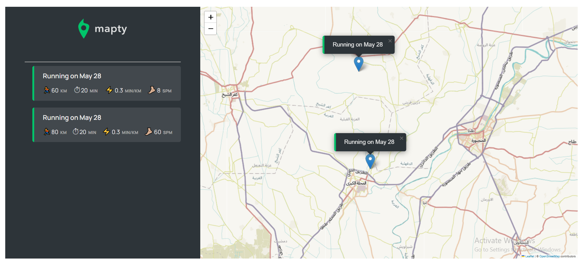

# 🗺️ Mapty

Mapty is a workout tracking application that allows users to log running and cycling workouts on a map. Built using JavaScript, Leaflet library, and Geolocation API.



---

## 🌐 Live Demo

Try the live application here:  
[https://mapty-tarneem.netlify.app/](https://mapty-tarneem.netlify.app/)

---

## 🚀 Features

- 🌍 Displays your current location on the map
- 🏃 Log running or cycling workouts with distance, duration, and more
- 📍 Workouts are pinned on the map at the selected location
- 📋 Displays workout data in a list with calculated pace or speed
- 💾 Stores workouts in localStorage for persistence
- 🔁 Automatically reloads saved workouts from localStorage

---

## 🛠️ Tech Stack

- HTML5, CSS3, JavaScript (ES6+)
- [Leaflet.js](https://leafletjs.com/) – Interactive maps
- Geolocation API
- localStorage for persistence

---

## 📦 How to Use

1. **Clone the repo**

```bash
git clone https://github.com/TarneemMagdy/mapty.git
cd mapty


## 🧑‍💻 Usage

- Use provided demo accounts to log in (see below)  
- Explore features like transfers, loans, and account closing  
- Watch your account balance and movements update in real time  

## 📝 Demo Accounts

| Username | PIN  | Account Owner     |
| -------- | ---- | ----------------- |
| js       | 1111 | Jonas Schmedtmann |
| jd       | 2222 | Jessica Davis     |